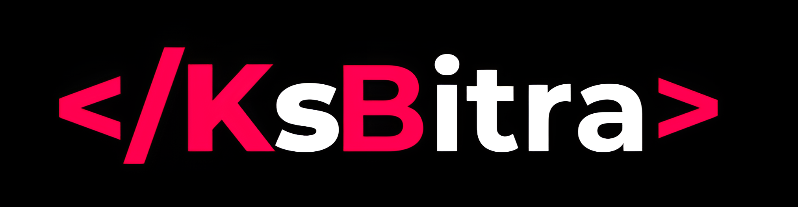

# Personal Portfolio Website

Welcome to the repository for **Krishnasai Bitra's Personal Portfolio Website**!  
This website showcases my background, skills, projects, and experiences, and provides a way to connect with me.  
The project is built using HTML, CSS, JavaScript, and Bootstrap for responsive design.

---

## 🚀 Overview

This is a personal portfolio website designed to highlight my:

- **About Me**: Brief intro and educational background.
- **Skills**: Technologies and tools I am proficient in.
- **Projects**: Some of my notable projects with links to source code.
- **Experience**: Highlights of my work and learning journey.
- **Contact**: Ways to connect with me, including a contact form and social profiles.
- **Resume Download**: Direct link to download my resume.

---

## 🖥️ Demo

You can view the live demo (if deployed) or see screenshots in the `images/` folder.

---

## 📂 Project Structure

```
index.html
style.css
/images
  ├── logo1.png
  ├── background.jpg
  ├── user.JPG
  ├── work-1.png
  └── ... (other images)
images/krishna_CV.pdf
```

---

## ✨ Features

### Header & Navigation
- Responsive navbar with logo and hamburger menu for mobile.
- Smooth scrolling between sections.

### About Section
- Personal introduction.
- Tabbed interface for Skills, Experience, and Education.
- Profile image.

### Projects Section
- Grid view of selected projects.
- Each project includes an icon, description, and "Learn More" link to GitHub.

### Experience Section
- Card-based layout highlighting experience/projects.
- Hover effect reveals more details and action buttons.

### Contact Section
- Contact information (email, phone, location).
- Social media icons (LinkedIn, GitHub, Instagram, Twitter).
- Contact form (can be configured for backend or Google Sheets).

### Resume Download
- Button to download the latest resume as PDF.

### Footer
- Copyright.

---

## 🛠️ Technologies Used

- **HTML5** & **CSS3**: Structure and styling.
- **Bootstrap 4.5**: Responsive grid and components.
- **Font Awesome**: Icons for UI and social links.
- **JavaScript (Vanilla)**: Menu toggle, tab switching, and interactivity.
- **jQuery & Popper.js**: For Bootstrap dependencies.
- **Google Fonts** (optional): For typography.

---

## 📱 Responsive Design

The site is fully responsive and adapts to various screen sizes using Bootstrap's grid system and custom media queries.

---

## 📝 Customization Guide

1. **Update Content**:
   - Change images in the `/images` folder.
   - Edit text content in `index.html` for About, Projects, Experience, etc.

2. **Add/Remove Projects**:
   - Duplicate or remove project `<div>` elements in the Projects section.

3. **Update Resume**:
   - Replace `images/krishna_CV.pdf` with your latest resume (ensure filename matches).

4. **Contact Form**:
   - By default, the form is set up for possible integration with Google Sheets or other backend handlers.  
     Update the form `action` as needed for your backend.

5. **Social Links**:
   - Update social profile URLs in the Contact section.

---

## 🖼️ Screenshots



---

## 💡 How to Run Locally

1. Clone the repository:
   ```bash
   git clone https://github.com/KrishnasaiBitra/portfolio_Edunet.git
   ```
2. Open `index.html` in your browser.

No build steps required—everything is static!

---

## 🙌 Acknowledgements

- [Bootstrap](https://getbootstrap.com/)
- [Font Awesome](https://fontawesome.com/)
- [jQuery](https://jquery.com/)
- Inspiration from various online portfolio templates.

---

## 📧 Contact

Feel free to connect with me:

- **Email:** bitrakrishnasaiofficial@gmail.com
- **Phone:** +91 92814 26559
- **LinkedIn:** [Krishnasai Bitra](https://www.linkedin.com/in/krishnasai-bitra/)
- **GitHub:** [KrishnasaiBitra](https://github.com/KrishnasaiBitra/)
- **Instagram:** [krishnasai._bitra](https://www.instagram.com/krishnasai._bitra/)
- **Twitter/X:** [@Krishnasai_b](https://x.com/Krishnasai_b)

---

## 📄 License

This project is for personal portfolio use.  
Feel free to fork and customize for your own personal website!

---
